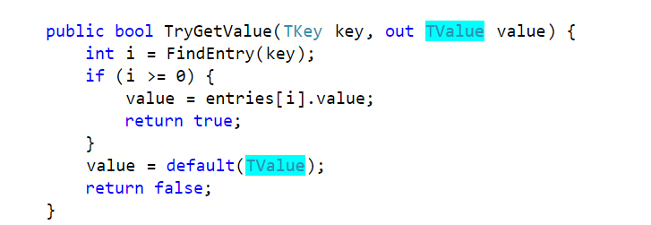

# csharp_test
2022.4.28
---------
ref,in,out关键字测试  
ref 值类型参数按引用传递，可以避免值类型拷贝，但是方法内修改会影响外部  
in  不能修改  
out 必须赋值

2022.4.29
---------
out参数在方法内会赋值

2022.5.5
--------
ref修饰引用类型  
https://www.jianshu.com/p/fc4d48bb5091
